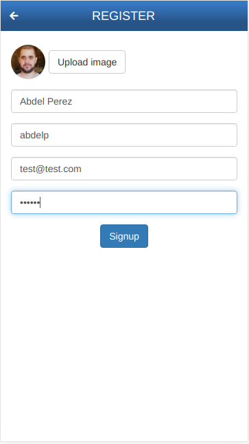
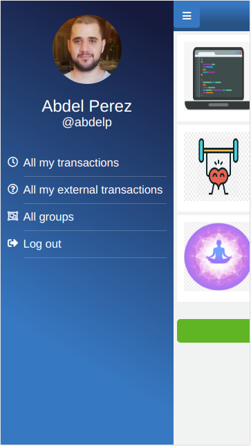
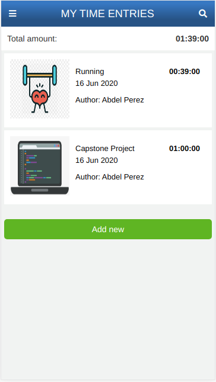
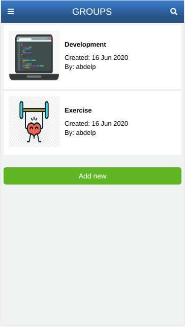

# Activities Tracker (ClockRoR)

> This project consists of an app that tracks your activities. Each activity is specified with a starting and ending DateTime, they also can be included in groups. All of the requirements are listed [here](https://www.notion.so/Group-our-transactions-ccea2b6642664540a70de9f30bdff4ce)

## Built With

- Ruby >= 2.6.5
- Rails >= 6.0.3
- Postgres >= 9.5
- Bootstrap >= 3
- Javascript

## Video Presentation

[Video link](https://www.loom.com/share/68fa44cadc4e4597a410a3ce3918e1ff)

## Live Demo

[Live Demo Link](https://whispering-retreat-92662.herokuapp.com)


## Prerequisites

- [PostreSQL](https://www.postgresql.org/download/)
- To run Capybara test with Selenium: [chromium chrome driver](https://chromedriver.chromium.org/downloads)

### Setup

Clone or download the repo:

```
$ git clone git@github.com:abdelp/ror-capstone.git
```

### Install

```
$ cd ror-capstone
$ bundle
$ rails db:create
$ rails db:migrate
```

### Usage

Inside the root folder run:

```
rails s
```

#### Register



To register a new user you:

1. Can optionally select an image as an avatar of the user.
2. Need to input the full name of your user.
3. Need to select a username, the username cannot be already taken by another user.
4. Need to indicate your email.
5. A password of at least 6 characters.

#### Login


To login, it is only required to specify the username.

#### Profile



#### Time entries



To create a new time entry you:

1. Need to specify a description of the Time Entry.
2. Select the starting time of the activity.
3. Select the ending time of the activity, it must be greater than the starting time.
4. The total amount of time is automatically calculated once the starting and ending time is selected.
5. Can optionally select a previously created group for the Time Entry.

To display all of the time entries created by the logged in user 


### Groups



To create a new group you:

1. Can optionally select an image.
2. Need to select a name for the group.

### Run tests

1. To run the tests where an image upload it's available you need to put an image "profile.png" in your /tmp folder.
2. The tests with selenium require the previous installation of [chromium chrome driver](https://chromedriver.chromium.org/downloads) compatible with the chrome browser to use.
3. Run the tests with:

```
rspec
```

### Deployment

To deploy on Heroku:

1. You need to register an account on [Heroku](https://www.heroku.com)

2. After that, inside the root folder, you need to create and migrate the project:

```
$ heroku create
$ git push heroku master
$ heroku run rails db:migrate
```

## Authors

👤 **Abdel Perez**

- Github: [@abdelp](https://github.com/abdelp)
- Twitter: [@AbdelPerez11](https://twitter.com/AbdelPerez11)
- Linkedin: [abdel-perez](https://www.linkedin.com/in/abdel-perez)

## 🤝 Contributing

Contributions, issues and feature requests are welcome!

Feel free to check the [issues page](issues/).

## Show your support

Give a ⭐️ if you like this project!

## Acknowledgments

- All credits for the design goes to [Gregoire Vella](https://www.behance.net/gallery/19759151/Snapscan-iOs-design-and-branding?tracking_source=)
- Sidebar template inspired by [bootstrapious](https://bootstrapious.com)

## 📝 License

This project is [MIT](lic.url) licensed.
